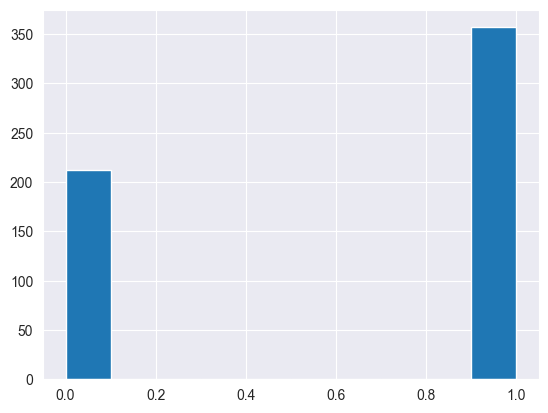
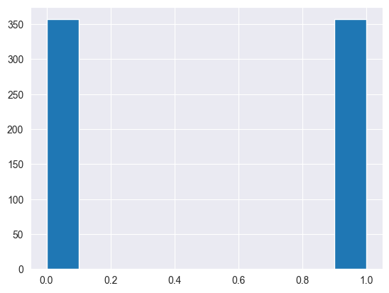
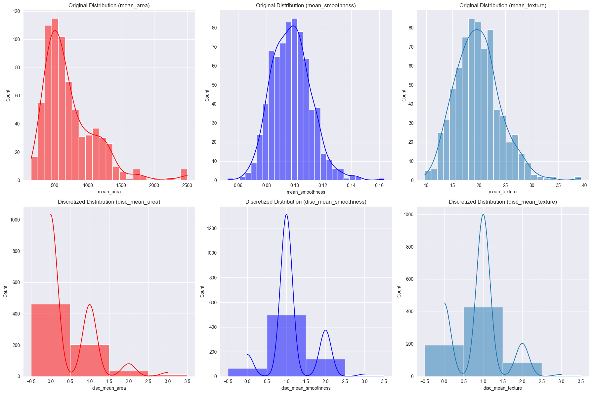

# Naive_Bayes_first_principles
Naive Bayes from scratch for Breast Cancer.

## Overview

This project focuses on breast cancer classification using a Naive Bayes classifier. It involves data preprocessing, exploratory data analysis, and the implementation of a Gaussian Naive Bayes model. Additionally, oversampling with RandomOverSampler is applied to address class imbalance.

## Project Structure

- **Dataset:** Breast cancer data `Breast_cancer_data.csv`.
- **Notebooks/Scripts:**
  - `Breast_Cancer_Classification.ipynb`: Jupyter Notebook containing the project code.
- **Dependencies:**
  - Python 3.x
  - Libraries: pandas, numpy, seaborn, scikit-learn, imbalanced-learn

## Setup

1. Clone the repository:

   ```bash
   git clone <repository-url>
   cd breast-cancer-classification
   ```
   
2. Install the required dependencies:

    ```bash
    pip install -r requirements.txt
    ```

3. Run the notebook:

    ```bash
    jupyter notebook Breast_Cancer_Classification.ipynb
    ```

## Project Steps

Data Loading and Preprocessing:

Load the breast cancer dataset.
Check for and handle missing values.
Exploratory Data Analysis:

Visualize the target variable distribution.
Examine the correlation matrix.
Feature Selection:

Select relevant features based on correlation analysis.
Naive Bayes Model:

Implement Gaussian Naive Bayes model.
Evaluate model performance using confusion matrix and F1 score.
Handling Class Imbalance:

Use RandomOverSampler to address class imbalance.
Re-run the Naive Bayes model on the resampled data.

## Results
Present the key results, including model performance metrics and any insights gained from the analysis.





Reached up to 0.97 accuracy on most optimum settings.

## Next Steps
Discuss potential improvements, future work, and ways to expand the project.
